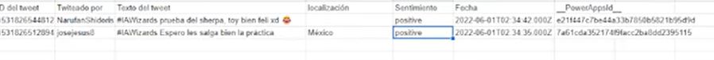

# Using AI to analyze tweet sentiment.

## Practice 4

-Search for Logic Apps in search and click on create. 

-We start by creating the subscription. 

-We will click on create and go to resources. 

-We will track tweets and their sentiments
Log in to cognitive services. 

-Click on create a logical application. 

-Type twitter and select it. 

-We start the section and give it a name and then enter the necessary data. 

-We created a Google drive with an Excel document with the following data. 

-Choose new step and write text, select the option marked. 

-We choose the feeling. 

-Here you will be prompted for an account name and URL. 

-To do this we will enter the language service in cognitive services. 

-Click on continue. 

-Click on review and create. 

-We go to key and connection point. 

-Copy the first key. 

-And we paste it in the previous window we created for feelings. 

-We copy the URL of the site and paste. 

-Click on create and select the following tags. 

-Type new step and choose Google sheet. 

-Choose insert row and log in. 

-Choose our previously created google sheet document. 

-Choose the calculation sheet and select all the parameters of the tweet. 

-We fill in the following tags 

-Select new step and choose Post message in a chat or teams channel. 

-We fill in the following with the following tags 

-Ready if you have completed all the steps you should be up and running. 
 
